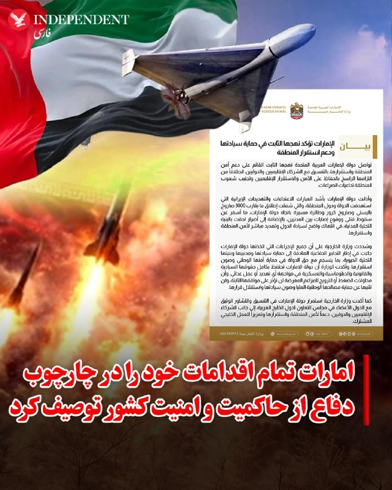
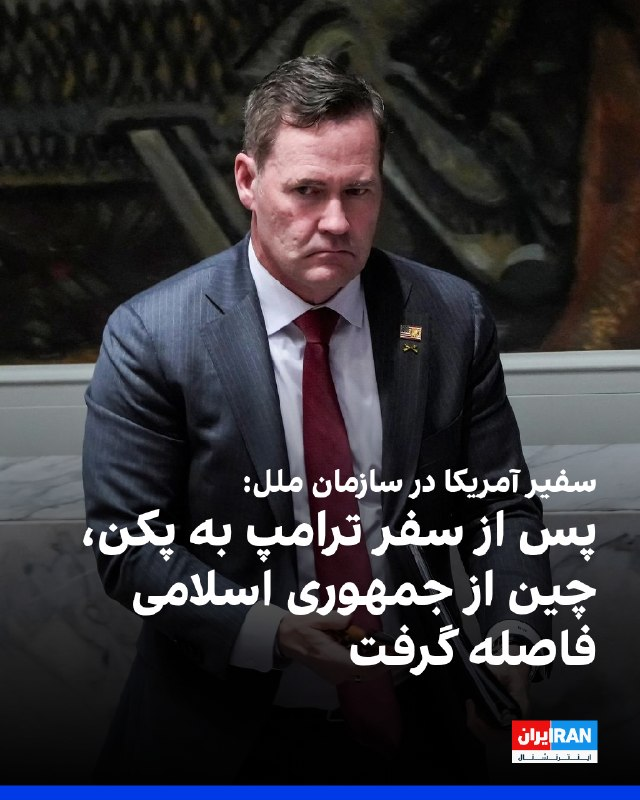
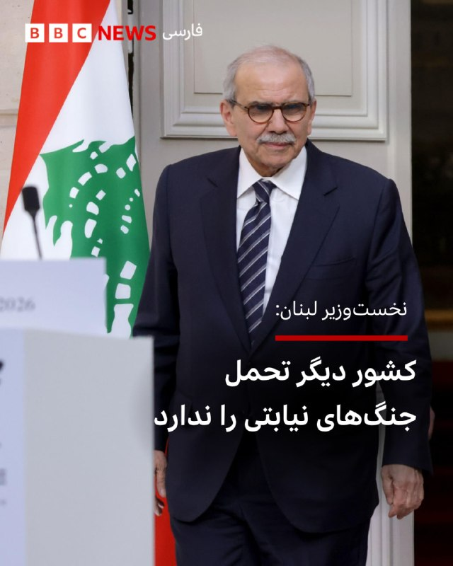

# خواننده تلگرام

<!-- TOP_NAV START -->

<a href="https://github.com/ProAlit/aio-downloader/blob/main/telegram/content/archive_1.md" style="display:inline-block; padding:6px 12px; margin:0 4px; background-color:#2ea44f; color:white; text-decoration:none; border-radius:4px; font-weight:bold;">صفحه بعد</a>

<!-- TOP_NAV END -->

<!-- MSG START -->

---
📅 بروزرسانی: 1405/02/26 07:14
---

## VahidOOnLine — post 240406

  

♦️به گزارش فاکس‌نیوز، دولت لبنان در اقدامی بی‌سابقه، با ارسال شکایت‌نامه‌ای تند به سازمان ملل متحد، جمهوری اسلامی را به سوءاستفاده از مصونیت دیپلماتیک متهم کرده است.
بر اساس این نامه که اواخر فروردین تنظیم و به‌تازگی منتشر شده است، احمد عرفه، سفیر لبنان در سازمان ملل، با انتقاد شدید از اقدامات محمدرضا شیبانی، سفیر جمهوری اسلامی در بیروت، تهران را به اعزام نیروهای سپاه پاسداران به خاک لبنان تحت پوشش فعالیت‌های دیپلماتیک متهم کرد.
در این شکایت‌نامه تاکید شده است این اقدامات جمهوری اسلامی، دخالت آشکار در امور داخلی لبنان است و این کشور را به جنگی ناخواسته می‌کشاند.
افشای این نامه همزمان با دومین روز گفتگوهای دوجانبه اسرائیل و لبنان در واشینگتن با میانجی‌گری آمریکا صورت می‌گیرد؛ گفتگوهایی که هدف آن عادی‌سازی روابط و برچیدن حزب‌الله عنوان شده است.
سخنگوی وزارت خارجه آمریکا فضای این مذاکرات را «بسیار مثبت» و «فراتر از حد انتظار» توصیف کرد. همچنین وزارت خارجه آمریکا اعلام کرد آتش‌بس موقت میان اسرائیل و لبنان ۴۵ روز دیگر تمدید شده است.
‌🇸🇦 Indypersian

🤖 @VahidOOnLine

---
📅 بروزرسانی: 1405/02/26 07:04
---

هیچ پیام جدیدی در این بروزرسانی ارسال نشد.

---
📅 بروزرسانی: 1405/02/26 06:55
---

## VahidOOnLine — post 240405

  

فدراسیون بین‌المللی روزنامه‌نگاران اعلام کرد با گذشت حدود ۱۰ روز از بازداشت امیرحسین رضایی، روزنامه‌نگار حوزه اقتصاد در اراک، همچنان خبری از وضعیت او در دست نیست و بازداشت او ادامه دارد.
پیش‌تر گزارش شده بود نیروهای امنیتی صبح ۱۶ اردیبهشت با یورش به منزل پدری رضایی در اراک، او را بازداشت و به مکان نامعلومی منتقل کرده‌اند. رضایی دانشجوی علوم سیاسی دانشگاه تهران و روزنامه‌نگار پیشین «دنیای اقتصاد» است.
فدراسیون بین‌المللی روزنامه‌نگاران نوشت ادامه بازداشت و بی‌خبری از این روزنامه‌نگار در حالی است که محدودیت‌های اینترنتی در ایران ادامه دارد و فشار نهادهای امنیتی بر فعالان رسانه و اطلاع‌رسانی مستقل افزایش یافته است.

‌🏁 🇬🇧 IranintlTV

🤖 @VahidOOnLine

## IranIntlTV — post 337407

  

فدراسیون بین‌المللی روزنامه‌نگاران اعلام کرد با گذشت حدود ۱۰ روز از بازداشت امیرحسین رضایی، روزنامه‌نگار حوزه اقتصاد در اراک، همچنان خبری از وضعیت او در دست نیست و بازداشت او ادامه دارد.
پیش‌تر گزارش شده بود نیروهای امنیتی صبح ۱۶ اردیبهشت با یورش به منزل پدری رضایی در اراک، او را بازداشت و به مکان نامعلومی منتقل کرده‌اند. رضایی دانشجوی علوم سیاسی دانشگاه تهران و روزنامه‌نگار پیشین «دنیای اقتصاد» است.
فدراسیون بین‌المللی روزنامه‌نگاران نوشت ادامه بازداشت و بی‌خبری از این روزنامه‌نگار در حالی است که محدودیت‌های اینترنتی در ایران ادامه دارد و فشار نهادهای امنیتی بر فعالان رسانه و اطلاع‌رسانی مستقل افزایش یافته است.

https://iranintl.com/202605161865

---
📅 بروزرسانی: 1405/02/26 06:44
---

## VahidOOnLine — post 240404

  

♦️وزارت امور خارجه امارات متحده عربی شنبه ۲۶ اردیبهشت با انتشار بیانیه‌ای اعلام کرد تمام اقدامات این کشور در چارچوب تدابیر دفاعی برای حفاظت از حاکمیت، غیرنظامیان و زیرساخت‌های حیاتی انجام شده است.
این بیانیه پس از آن صادر شد که روزنامه وال‌استریت ژورنال در گزارشی نوشت امارات در اواسط فروردین عملیات نظامی علیه ایران انجام داده است؛ با این حال، وزارت خارجه امارات در بیانیه خود مستقیما به این حملات ادعایی اشاره‌ای نکرد.
امارات در این بیانیه با محکوم کردن شدید تهدیدها و حملات جمهوری اسلامی به این کشور و منطقه، اعلام کرد که شلیک نزدیک به ۳۰۰۰ موشک بالستیک، کروز و پهپاد به سمت امارات که منجر به تلفات غیرنظامی و آسیب به زیرساخت‌ها شده، نقض آشکار حاکمیت کشورها است. وزارت خارجه امارات تاکید کرد که این کشور حق حاکمیتی، قانونی، دیپلماتیک و نظامی خود را برای مقابله با هرگونه اقدام خصمانه محفوظ می‌داند و فشارها یا ادعاهای مغرضانه تاثیری بر مواضع ثابت آن نخواهد داشت.
‌🇸🇦 Indypersian

🤖 @VahidOOnLine

---
📅 بروزرسانی: 1405/02/26 06:34
---

## VahidOOnLine — post 240403

  

فاکس‌نیوز گزارش داد دولت لبنان با ارسال نامه‌ای کم‌سابقه به سازمان ملل، جمهوری اسلامی را به سوءاستفاده از مصونیت دیپلماتیک، دخالت در امور داخلی لبنان و انتقال نیروهای سپاه پاسداران «در پوشش فعالیت دیپلماتیک» متهم کرده است.
به گزارش فاکس، این نامه که اواخر آوریل ارسال و به‌تازگی منتشر شده، هم‌زمان با مذاکرات اسرائیل و لبنان در واشینگتن درباره عادی‌سازی روابط و آینده حزب‌الله اهمیت بیشتری یافته است.
در این نامه، سفیر لبنان در سازمان ملل، ایران را به «اقدامات غیرقانونی در نقض آشکار تصمیمات دولت لبنان» متهم کرده و تأکید کرده این رفتار دخالت مستقیم در امور داخلی لبنان و نقض کنوانسیون ۱۹۶۱ وین درباره روابط دیپلماتیک است.

‌🏁 🇬🇧 IranintlTV

🤖 @VahidOOnLine

## IranIntlTV — post 337406

  

فاکس‌نیوز گزارش داد دولت لبنان با ارسال نامه‌ای کم‌سابقه به سازمان ملل، جمهوری اسلامی را به سوءاستفاده از مصونیت دیپلماتیک، دخالت در امور داخلی لبنان و انتقال نیروهای سپاه پاسداران «در پوشش فعالیت دیپلماتیک» متهم کرده است.
به گزارش فاکس، این نامه که اواخر آوریل ارسال و به‌تازگی منتشر شده، هم‌زمان با مذاکرات اسرائیل و لبنان در واشینگتن درباره عادی‌سازی روابط و آینده حزب‌الله اهمیت بیشتری یافته است.
در این نامه، سفیر لبنان در سازمان ملل، ایران را به «اقدامات غیرقانونی در نقض آشکار تصمیمات دولت لبنان» متهم کرده و تأکید کرده این رفتار دخالت مستقیم در امور داخلی لبنان و نقض کنوانسیون ۱۹۶۱ وین درباره روابط دیپلماتیک است.

https://iranintl.com/202605166136

## BBCPersian — post 281165

‌ ‌ ‌
حمله هوایی اسرائیل که ظهر شنبه گذشته بدون هیچ هشداری رخ داد، ساختمانی را در منطقه سکسکیه در جنوب لبنان ویران کرد که خانواده‌ای آواره از جنگ در آن پناه گرفته بودند. آتش‌بسی که ماه گذشته اعلام شد، نتوانسته درگیری میان اسرائیل و حزب‌الله را متوقف کند. در این بخش از لبنان، حملات اسرائیل شبانه‌روز ادامه دارد.

وقتی به محل رسیدم، نیروهای امدادی جست‌وجو را به پایان رسانده بودند. مردی روی آوارها در سکوت به ویرانی خیره شده بود. همسایه‌ها دوچرخه آسیب‌دیده یک کودک و خرس عروسکی بنفشی را که پوشیده از گرد و خاک بود، از زیر آوار بیرون آورده بودند.

در این حمله ۹ نفر کشته شدند. ارتش اسرائیل گفت اعضایی از حزب‌الله را هدف قرار داده که از ساختمانی با «کاربری نظامی» فعالیت می‌کردند و «تهدیدی فوری» به شمار می‌رفتند. اسرائیل جزئیات بیشتری ارائه نکرد.

https://bbc.in/4wwDC4L
📸Neha Sharma/BBC/ GettyImages/ AFP via Getty Images
@BBCPersian

---
📅 بروزرسانی: 1405/02/26 06:24
---

هیچ پیام جدیدی در این بروزرسانی ارسال نشد.

---
📅 بروزرسانی: 1405/02/26 06:14
---

## Persian_Trend_Official — post 14226

  <a href="telegram/content/Persian_Trend_Official_14226_1778899494.mp4" target="_blank">🎬 Download video</a>

صبحتون بخیر ☕️🤍

📝 Nick
📌 @persian_trend_official
پرشین ترند | متفاوت‌ترین کانال نظامی

## BBCPersian — post 281164

🔻 ترامپ از سفر چین به آمریکا بازگشت

دونالد ترامپ، رئیس جمهور آمریکا پس از سفرش به چین به کشورش بازگشت.

به گزارش رویترز، سفر رسمی دو روزه ترامپ به پکن شامل گفت‌وگو با شی جین‌پینگ، رئیس جمهور چین درباره تایوان، ایران و تجارت بود، اما درباره مسائل اختلافی میان دو اقتصاد بزرگ جهان، دستاورد مشخصی به همراه نداشت.

آقای ترامپ پس از ورود به آمریکا به خبرنگاران گفت: «تنها چیزی که می‌توانم بگویم این است که آن سفر موفقیتی بزرگ بود. ما توافق‌های بزرگی انجام دادیم، توافق‌های تجاری بسیار خوبی داشتیم و روابط فوق‌العاده‌ای برقرار کردیم. اتفاقات زیادی افتاده که به‌زودی درباره آن‌ها خواهید شنید. فکر می‌کنم این واقعا یک موفقیت عظیم و لحظه‌ای تاریخی بود.»

او همچنین گفت که شی جین‌پینگ در ماه سپتامبر سال جاری میلادی سفری متقابل به واشنگتن خواهد داشت.

https://bbc.in/4dth6kD
@BBCPersian

---
📅 بروزرسانی: 1405/02/26 06:04
---

## VahidOOnLine — post 240402

  

مایک والتز، سفیر آمریکا در سازمان ملل، در گفت‌وگو با فاکس‌نیوز گفت چین پس از سفر دونالد ترامپ به پکن از جمهوری اسلامی فاصله گرفته است. او افزود پکن با اصل عدم دستیابی ایران به سلاح هسته‌ای و عدم نظامی‌سازی تنگه هرمز موافقت کرده است.
والتز تاکید کرد هیچ کشوری نمی‌تواند از خطوط کشتیرانی بین‌المللی مانند تنگه جبل‌الطارق، تنگه مالاکا یا تنگه هرمز به‌عنوان منبع درآمد خصوصی از طریق دریافت عوارض استفاده کند و این مسیرها باید برای تجارت جهانی باز بمانند.

‌🏁 🇬🇧 IranintlTV

🤖 @VahidOOnLine

## BBCPersian — post 281163

  

‌ ‌ ‌ ‌
یک فرمانده شبه‌نظامیان عراقی به اتهام نقش داشتن در طراحی بیش از ۱۲ حمله «تروریستی» در آمریکای شمالی و اروپا بازداشت شده است؛ حملاتی که به گفته مقام‌های قضایی در واکنش به جنگ با ایران برنامه‌ریزی شده بود.

مقام‌های قضایی آمریکا می‌گویند که محمد باقر سعد داوود ساعدی، ۳۲ ساله، در حال طراحی حمله به یک کنیسه در نیویورک و دو مرکز یهودی در لس‌آنجلس و اسکاتسدیل بوده است.

بر اساس شکایت کیفری، او با شش اتهام مرتبط با تروریسم روبه‌رو است. وکیلش اما می‌گوید که او هدف «پیگردی سیاسی» قرار گرفته است.

به گفته مقام‌های آمریکایی، ساعدی از فرماندهان کتائب حزب‌الله است؛ گروهی مستقر در عراق که آمریکا آن را سازمانی تروریستی می‌داند و روابط نزدیکی با ایران دارد.

او که شهروند عراق است، ابتدا در ترکیه بازداشت شد و سپس به اف‌بی‌آی تحویل داده و به آمریکا منتقل شد.

ساعدی در دادگاه فدرال منهتن حاضر شد و تا زمان برگزاری محاکمه در بازداشت خواهد ماند.

https://bbc.in/4uggfuE
📷US Department of Justice
@BBCPersian

---
📅 بروزرسانی: 1405/02/26 05:53
---

## IranIntlTV — post 337405

  

مایک والتز، سفیر آمریکا در سازمان ملل، در گفت‌وگو با فاکس‌نیوز گفت چین پس از سفر دونالد ترامپ به پکن از جمهوری اسلامی فاصله گرفته است. او افزود پکن با اصل عدم دستیابی ایران به سلاح هسته‌ای و عدم نظامی‌سازی تنگه هرمز موافقت کرده است.
والتز تاکید کرد هیچ کشوری نمی‌تواند از خطوط کشتیرانی بین‌المللی مانند تنگه جبل‌الطارق، تنگه مالاکا یا تنگه هرمز به‌عنوان منبع درآمد خصوصی از طریق دریافت عوارض استفاده کند و این مسیرها باید برای تجارت جهانی باز بمانند.

https://iranintl.com/202605168445

## FarsiVOA — post 217869

  

⚡️مایک والتز، نماینده آمریکا در سازمان ملل متحد گفت در ارتباط با جمهوری اسلامی، مسئله اورانیوم غنی‌شده، غنی‌سازی اورانیوم، و تنگه هرمز وجود دارد. او به فاکس‌نیوز گفت «باید به یاد داشته باشیم، هیچ دلیلی وجود ندارد» جمهوری اسلامی اورانیوم با غنای ۶۰ درصد داشته باشد آن هم به میزانی که به گفته او می‌تواند به ۱۰ تا ۱۱ بمب هسته‌ای تبدیل شود. آقای والتز با زیر سوال بردن ادعای صلح‌آمیز بودن برنامه هسته‌ای جمهوری اسلامی گفت «هیچ کشوری در دنیا وجود ندارد که تا این سطح غنی‌سازی کند و بعد سلاح هسته‌ای نداشته باشد، چون اصلاً دلیلی برای انجامش (این سطح از غنی‌سازی) وجود ندارد.»
@FarsiVOA

---
📅 بروزرسانی: 1405/02/26 05:43
---

## FarsiVOA — post 217868

⚡️مراسم «انجمن قلم آمریکا» و اهدای «جایزه آزادی نوشتن باربی» به گلرخ ایرایی و علی اسداللهی
@FarsiVOA

---
📅 بروزرسانی: 1405/02/26 05:34
---

## VahidOOnLine — post 240401

  

♦️مایک والتز، سفیر آمریکا در سازمان ملل در گفتگو با شبکه فاکس نیوزگفت: «باید به یاد داشته باشیم هیچ دلیلی وجود ندارد که رژیم ایران این گرد و غبار را که شامل اورانیوم با غنای بالای ۶۰ درصد است، در اختیار داشته باشد. هیچ کشوری در جهان وجود ندارد که تا این سطح غنی سازی کند و سلاح هسته‌ای نداشته باشد، چون هیچ دلیل دیگری برای این کار وجود ندارد.»
او افزود: «اگر اهداف شما صرفا صلح‌آمیز و غیرنظامی است، دلیلی ندارد آن را در عمق سایت‌های نظامی مستحکم دفن کنید و در سراسر کشور پراکنده سازید. این مواد برای ساخت ۱۰ یا ۱۱ سلاح هسته‌ای کافی است و رئیس‌جمهوری ترامپ به صراحت اعلام کرده که این بخش باید برچیده شود.»
والتز همچنین تاکید کرد: «ما در عملیات "چکش نیمه‌شب" در سال گذشته، غنی سازی آن‌ها را ویران کردیم، اما هنوز می‌بینیم که در تلاش برای بازسازی آن هستند.»
‌🇸🇦 Indypersian

🤖 @VahidOOnLine

## FarsiVOA — post 217867

⚡️توافق آمریکا و چین درباره تنگه هرمز چه پیامدی برای حکومت ایران دارد؟ گفت‌وگو با ابراهیم روشندل
@FarsiVOA

## BBCPersian — post 281162

  

‌ ‌ ‌ ‌
نواف سلام، نخست‌وزیر لبنان، می‌گوید که کشورش دیگر تاب «جنگ‌های بی‌پروا» در خدمت منافع خارجی را ندارد و خواستار حمایت اعراب و جامعه جهانی از مذاکرات لبنان با اسرائیل شد.

آقای سلام در سخنرانی خود در یک ضیافت خیریه ابراز امیدواری کرد که «تمام حمایت‌های عربی و بین‌المللی برای تقویت موضع لبنان در مذاکرات» با اسرائیل بسیج شود.

این اظهارات اندکی پس از پایان تازه‌ترین دور گفت‌وگوها و تمدید آتش‌بس جاری برای ۴۵ روز مطرح شد که با میانجی‌گری آمریکا به اجرا گذاشته می‌شود.

او در انتقادی تلویحی از حزب‌الله، که در حمایت از ایران وارد جنگ خاورمیانه شده بود، گفت که لبنان «به اندازه کافی از این ماجراجویی‌های بی‌پروا در خدمت پروژه‌ها و منافع خارجی آسیب دیده» و تاکید کرد ارتش لبنان باید تنها نیروی مسلح آن کشور باشد.

https://bbc.in/4dxLD0L
📷 EPA/Shutterstock
@BBCPersian

<!-- MSG END -->

<!-- NAV START -->

<a href="https://github.com/ProAlit/aio-downloader/blob/main/telegram/content/archive_1.md" style="display:inline-block; padding:6px 12px; margin:0 4px; background-color:#2ea44f; color:white; text-decoration:none; border-radius:4px; font-weight:bold;">صفحه بعد</a>

<!-- NAV END -->
