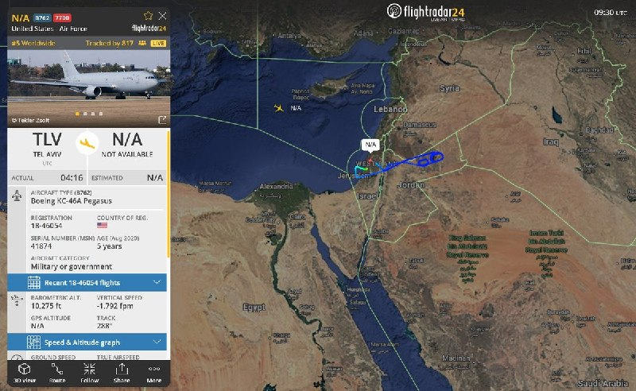
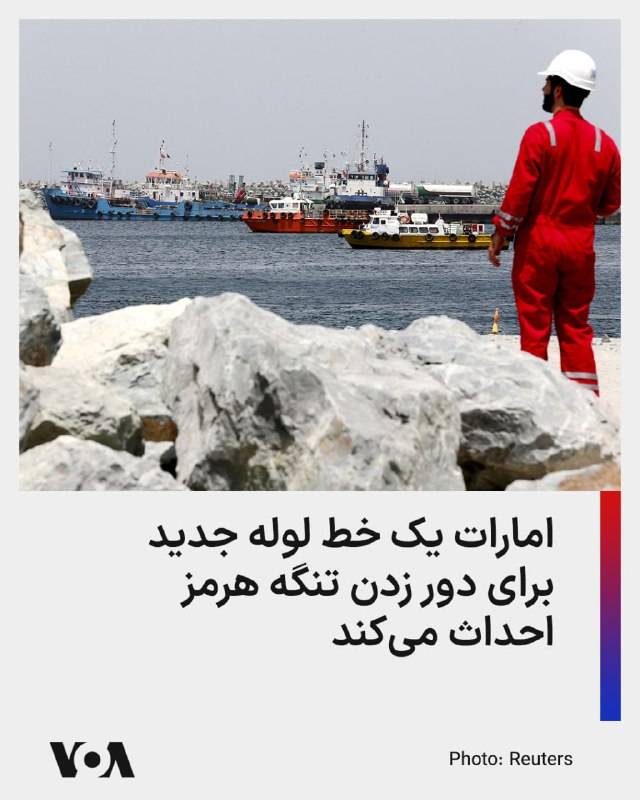
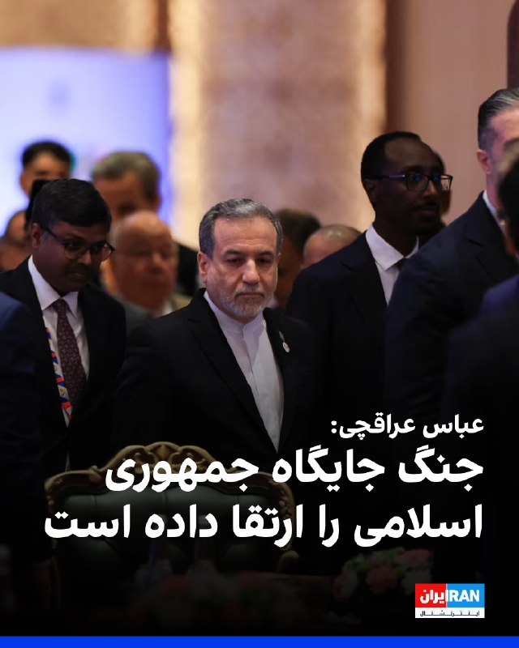
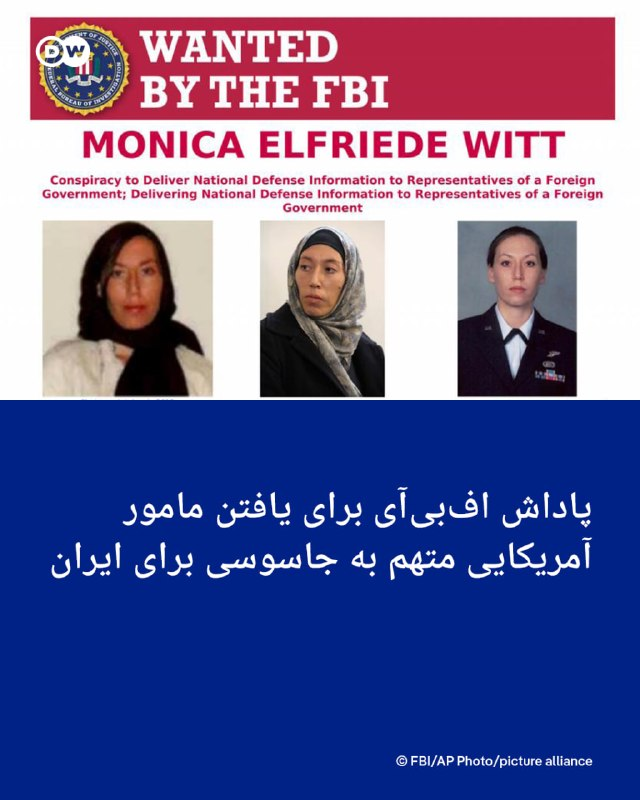

# خواننده تلگرام

<!-- TOP_NAV START -->

<a href="https://github.com/ProAlit/aio-downloader/blob/main/telegram/content/archive_1.md" style="display:inline-block; padding:6px 12px; margin:0 4px; background-color:#2ea44f; color:white; text-decoration:none; border-radius:4px; font-weight:bold;">صفحه بعد</a>

<!-- TOP_NAV END -->

<!-- MSG START -->

---
📅 بروزرسانی: 1405/02/25 13:05
---

## VahidOOnLine — post 240276

  <a href="telegram/content/VahidOOnLine_240276_1778837748.mp4" target="_blank">🎬 Download video</a>

یک شهروند در پیامی به ایران اینترنشنال به سایر شهروندان توصیه می‌کند که اینترنت حکومتی «پرو» را نخرند و آن ‌را خیانت به مردم ایران دانست. پیام او با هوش مصنوعی خوانده شده است.
‌🏁 🇬🇧 IranintlTV

🤖 @VahidOOnLine

## VahidOOnLine — post 240275

  

تجربیات شما از قطع برق و آب و افزایش قیمت قبض‌ها چیست؟ روی لینک زیر کلیک کنید و پیام‌های خود از طریق مدیا‌بات برای ما بفرستید. 
t.me
پیام‌های شما به صورت زیر‌نویس در تلویزیون و همچنین در بخش‌های مختلف‌ خبری منتشر خواهد شد.
‌🏁 🇬🇧 IranintlTV

🤖 @VahidOOnLine

## VahidOOnLine — post 240274

  <a href="telegram/content/VahidOOnLine_240274_1778837750.mp4" target="_blank">🎬 Download video</a>

نارندرا مودی، نخست‌وزیر هند، روز جمعه ۲۵ اردیبهشت در جریان سفر به ابوظبی، با انتشار پیامی در شبکه اجتماعی ایکس نوشت: «دوستی میان هند و امارات بسیار نیرومند است.»

مودی در این سفر با شیخ محمد بن زاید، رئیس امارات متحده عربی، دیدار کرد. محور گفتگوهای دو طرف، گسترش روابط دوجانبه، همکاری‌های انرژی، همکاری‌های دفاعی و تحولات منطقه‌ای اعلام شده است.

این سفر در شرایطی انجام می‌شود که تنش‌های منطقه‌ای و نگرانی‌ها درباره امنیت مسیرهای انرژی، اهمیت همکاری میان هند و امارات را افزایش داده است. امارات یکی از شرکای مهم هند در حوزه انرژی و تجارت به شمار می‌رود و ابوظبی و دهلی نو در سال‌های اخیر روابط اقتصادی و راهبردی خود را گسترش داده‌اند.
‌🏁 🇬🇧 ManotoTV

🤖 @VahidOOnLine

## VahidOOnLine — post 240273

  <a href="telegram/content/VahidOOnLine_240273_1778837751.mp4" target="_blank">🎬 Download video</a>

عباس عراقچی، وزیر خارجه جمهوری اسلامی، در گفتگو با رسانه دولتی هند گفت «هیچ راه‌حل نظامی‌ای وجود ندارد» و افزود ایالات متحده باید این واقعیت را درک کند.

او گفت آمریکا «دست‌کم دو بار» جمهوری اسلامی را آزموده و اکنون به این نتیجه رسیده است که «راه‌حل نظامی وجود ندارد».

عراقچی مهم‌ترین مشکل در روند کنونی را «پیام‌های متناقض» از سوی مقام‌های آمریکایی دانست و گفت این پیام‌ها از طریق اظهارنظرها، مصاحبه‌ها و مواضع مختلف دریافت می‌شود.
‌🏁 🇬🇧 ManotoTV

🤖 @VahidOOnLine

## VahidOOnLine — post 240272

  <a href="telegram/content/VahidOOnLine_240272_1778837751.mp4" target="_blank">🎬 Download video</a>

رسانه دولتی اسرائیل گزارش داد ایال زامیر، رئیس ستاد ارتش اسرائیل، در جریان جنگ با ایران به امارات متحده عربی سفر کرده است.
بر اساس این گزارش، او همراه با چند مقام نظامی اسرائیل با مقام‌های اماراتی، از جمله محمد بن زاید، رئیس امارات، دیدار کرده است. ارتش اسرائیل تاکنون واکنشی به این گزارش نشان نداده است.
این گزارش پس از آن منتشر می‌شود که بنیامین نتانیاهو نیز گفته بود در زمان جنگ به امارات سفر کرده؛ ادعایی که از سوی امارات رد شد. همچنین گزارش‌هایی درباره سفر رؤسای سازمان‌های اطلاعاتی و امنیتی اسرائیل به امارات در زمان جنگ منتشر شده است.
در همین حال، مقام‌های آمریکایی تأیید کرده‌اند اسرائیل یک سامانه پدافند موشکی را به همراه نیروهای نظامی برای راه‌اندازی آن به امارات منتقل کرده است.
‌🏁 🇬🇧 ManotoTV

🤖 @VahidOOnLine

## WithYashar — post 11274

خبرنگار الجزیره:
تهران به‌طور رسمی پاسخ واشنگتن به پیشنهاد خود را دریافت کرده و ایالات متحده تمامی شروط ایران رو رد کرده.
@withyashar

## mwarmonitor — post 9110

  <a href="telegram/content/mwarmonitor_9110_1778837752.mp4" target="_blank">🎬 Download video</a>

📝 کارشناسان دوزاری و جیره‌خوار صداوسیما طوری از «دستان خالی» ترامپ در پکن قرقره می‌کنند که انگار دیپلماسی یعنی همان وحشی‌گری فرقه رذل شما در نیویورک که برای جابه‌جایی خریدهای حقیرانه‌تان باید کاروان کامیون راه می‌انداختید! بله، از نظر این اراذل گشنه‌چشم، توافق برای رفاه و اقتصاد مردم یعنی ضعف، اما غارت فروشگاه‌های یانکی‌ها و پر کردن خندق بلا با سوغاتی یعنی اقتدار!

🔸ترامپ دست‌خالی برگشت چون مثل شما گدای برند نبود که هواپیما را تبدیل به وانتبار کند؛ اما شما که وسط جفتک‌اندازی‌های رسانه‌ای از «موضع قدرت» نطق می‌کنید، یادتان رفته که لاشه متعفن رهبرتان، با آن همه ادعای پوشالی، فعلاً در یخچال بستنی میهن در حال تجزیه شدن است؟ تفاوت در همین اوج ذلت است: یکی برای رفاه مردمش توافق می‌کند و دیگری آن‌قدر ذلیل و حقیر است که حتی جنازه‌اش هم بین بستنی عروسکی و فالوده، با خفت تمام در حال متلاشی شدن است تا ثابت کند کل هیمنه این فرقه، به اندازه یک فریزر لبنیاتی هم دوام ندارد!

@mwarmonitor

## pm_afshaa — post 90770

  <a href="telegram/content/pm_afshaa_90770_1778837753.webm" target="_blank">🎬 Download video</a>

🔴وای‌نت: اسرائیل خودش رو برای احتمال ازسرگیری اقدام نظامی آمریکا علیه جمهوری اسلامی آماده می‌کنه و رهبران سیاسی به ارتش دستور دادن آمادگی‌های لازم رو در نظر بگیرن.

💧 Rainbet.com the #1 Non-KYC Crypto Casino & Sportsbook @rainbetcom

😁 @Pm_Afshaa

## pm_afshaa — post 90769

  <a href="telegram/content/pm_afshaa_90769_1778837754.webm" target="_blank">🎬 Download video</a>

🔴خبرنگار الجزیره:
تهران به‌طور رسمی پاسخ واشنگتن به پیشنهاد خود را دریافت کرده و ایالات متحده تمامی شروط ایران رو رد کرده.

💧 Rainbet.com the #1 Non-KYC Crypto Casino & Sportsbook @rainbetcom

😁 @Pm_Afshaa

## IranIntlTV — post 337290

  <a href="telegram/content/IranIntlTV_337290_1778837754.mp4" target="_blank">🎬 Download video</a>

یک شهروند در پیامی به ایران اینترنشنال به سایر شهروندان توصیه می‌کند که اینترنت حکومتی «پرو» را نخرند و آن ‌را خیانت به مردم ایران دانست. پیام او با هوش مصنوعی خوانده شده است.

## IranIntlTV — post 337289

  

تجربیات شما از قطع برق و آب و افزایش قیمت قبض‌ها چیست؟ روی لینک زیر کلیک کنید و پیام‌های خود از طریق مدیا‌بات برای ما بفرستید. 
https://t.me/intlmedia_bot
پیام‌های شما به صورت زیر‌نویس در تلویزیون و همچنین در بخش‌های مختلف‌ خبری منتشر خواهد شد.

## Shin_Persian — post 6010

  

DefenceGeek 🇬🇧 ✓ @DefenceGeek Fri, 15 May 2026 09:32:18 UTC Tanker In-Flight Emergency #FreeIran‌ --- Operation EPIC FURY / Project FREEDOM --- One of the KC-46A "Pegasus" tanker from Tel Aviv Ben Gurion (LLBG) airport is declaring an in-flight emergency…

## Shin_Persian — post 6009

DefenceGeek 🇬🇧 ✓ @DefenceGeek
Fri, 15 May 2026 09:32:18 UTC

Tanker In-Flight Emergency #FreeIran‌
--- Operation EPIC FURY / Project FREEDOM ---

One of the KC-46A "Pegasus" tanker from Tel Aviv Ben Gurion (LLBG) airport is declaring an in-flight emergency and squawking 7700. KC-46s from this base are usually "YETI" callsigns

KC-46A "YETI??" 18-46054 #AE5FA1

@MATA_osint

فارسی

وضعیت اضطراری سوخت‌رسان در حین پرواز #FreeIran‌
--- عملیات خشم حماسی / پروژه آزادی ---

یکی از هواپیماهای سوخت‌رسان KC-46A «پگاسوس» از فرودگاه بن گوریون تل‌آویو (LLBG) وضعیت اضطراری در حین پرواز اعلام کرده و کد ۷۷۰۰ (squawk 7700) را مخابره می‌کند. سوخت‌رسان‌های KC-46 این پایگاه معمولاً با شناسه رادیویی «YETI» فعالیت می‌کنند.

KC-46A "YETI??" 18-46054 #AE5FA1

@MATA_osint

𝕏 · @shin_persian

## ManotoTV — post 105478

  <a href="telegram/content/ManotoTV_105478_1778837756.mp4" target="_blank">🎬 Download video</a>

نارندرا مودی، نخست‌وزیر هند، روز جمعه ۲۵ اردیبهشت در جریان سفر به ابوظبی، با انتشار پیامی در شبکه اجتماعی ایکس نوشت: «دوستی میان هند و امارات بسیار نیرومند است.»

مودی در این سفر با شیخ محمد بن زاید، رئیس امارات متحده عربی، دیدار کرد. محور گفتگوهای دو طرف، گسترش روابط دوجانبه، همکاری‌های انرژی، همکاری‌های دفاعی و تحولات منطقه‌ای اعلام شده است.

این سفر در شرایطی انجام می‌شود که تنش‌های منطقه‌ای و نگرانی‌ها درباره امنیت مسیرهای انرژی، اهمیت همکاری میان هند و امارات را افزایش داده است. امارات یکی از شرکای مهم هند در حوزه انرژی و تجارت به شمار می‌رود و ابوظبی و دهلی نو در سال‌های اخیر روابط اقتصادی و راهبردی خود را گسترش داده‌اند.

## ManotoTV — post 105477

  <a href="telegram/content/ManotoTV_105477_1778837757.mp4" target="_blank">🎬 Download video</a>

عباس عراقچی، وزیر خارجه جمهوری اسلامی، در گفتگو با رسانه دولتی هند گفت «هیچ راه‌حل نظامی‌ای وجود ندارد» و افزود ایالات متحده باید این واقعیت را درک کند.

او گفت آمریکا «دست‌کم دو بار» جمهوری اسلامی را آزموده و اکنون به این نتیجه رسیده است که «راه‌حل نظامی وجود ندارد».

عراقچی مهم‌ترین مشکل در روند کنونی را «پیام‌های متناقض» از سوی مقام‌های آمریکایی دانست و گفت این پیام‌ها از طریق اظهارنظرها، مصاحبه‌ها و مواضع مختلف دریافت می‌شود.

## ManotoTV — post 105476

  <a href="telegram/content/ManotoTV_105476_1778837757.mp4" target="_blank">🎬 Download video</a>

رسانه دولتی اسرائیل گزارش داد ایال زامیر، رئیس ستاد ارتش اسرائیل، در جریان جنگ با ایران به امارات متحده عربی سفر کرده است.
بر اساس این گزارش، او همراه با چند مقام نظامی اسرائیل با مقام‌های اماراتی، از جمله محمد بن زاید، رئیس امارات، دیدار کرده است. ارتش اسرائیل تاکنون واکنشی به این گزارش نشان نداده است.
این گزارش پس از آن منتشر می‌شود که بنیامین نتانیاهو نیز گفته بود در زمان جنگ به امارات سفر کرده؛ ادعایی که از سوی امارات رد شد. همچنین گزارش‌هایی درباره سفر رؤسای سازمان‌های اطلاعاتی و امنیتی اسرائیل به امارات در زمان جنگ منتشر شده است.
در همین حال، مقام‌های آمریکایی تأیید کرده‌اند اسرائیل یک سامانه پدافند موشکی را به همراه نیروهای نظامی برای راه‌اندازی آن به امارات منتقل کرده است.

## FarsiVOA — post 217808

  

رسانه دولتی امارات از آغاز احداث یک خط لوله جدید برای دور زدن تنگه هرمز خبر داد.

بر اساس این گزارش، تصمیم برای توسعه یک خط لوله به بندر فجیره در دریای عمان طی اجلاس مدیران شرکت ملی نفت ابوظبی و ولیعهد این کشور گرفته شده و این پروژه تا سال ۲۰۲۷ به بهره‌برداری خواهد رسید.

امارات هم‌اکنون نیز یک خط لوله با ظرفیت انتقال روزانه ۱.۹ میلیون بشکه نفت به بندر فجیره دارد و با احداث خط لوله جدید، این ظرفیت دو برابر خواهد شد.

این کشور ظرفیت تولید روزانه نزدیک به پنج میلیون بشکه نفت دارد، اما به خاطر انسداد تنگه هرمز توسط جمهوری اسلامی، ماه گذشته تنها دو میلیون بشکه تولید انجام داد. امارات از ابتدای ماه جاری از اوپک خارج شد تا تولید نفت خود را با دست بازتری افزایش دهد.
@FarsiVOA

## Persian_Trend_Official — post 14181

🔴 الجزیره: آمریکا تمامی شروط ایران را رد کرده است

💢خبرنگار الجزیره گزارش داد تهران به‌صورت رسمی پاسخ واشینگتن به پیشنهاد ارائه‌شده از سوی ایران را دریافت کرده است.

بر اساس این گزارش:

▪️ ایالات متحده تمامی شروط مطرح‌شده از سوی ایران را رد کرده است

🫆:Tony

📌 @persian_trend_official
پرشین ترند | متفاوت‌ترین کانال نظامی

## Hranews — post 112950

  

برخلاف پیمان‌نامه حقوق کودک؛ یک نوجوان در جریان آموزش‌های نظامی جان باخت

❗️
❗️
❗️
❗️
❗️– برخلاف تعهدات بین‌المللی ایران تحت عنوان الحاق به پیمان‌نامه حقوق #کودک و تعهدات مربوط به عدم به‌کارگیری کودکان در امور نظامی، یک پسر ۱۷ ساله در شهرستان دیر حین انجام آموزش‌های نظامی جان خود را از دست داد. رسانه‌های رسمی او را از نیروهای بسیج معرفی کردند.

ادامه مطلب

↘️
@hranews_bot تماس ✉️ - @Hranews کانال هرانا 🆑

## manototv — post 105478

  <a href="telegram/content/manototv_105478_1778837759.mp4" target="_blank">🎬 Download video</a>

نارندرا مودی، نخست‌وزیر هند، روز جمعه ۲۵ اردیبهشت در جریان سفر به ابوظبی، با انتشار پیامی در شبکه اجتماعی ایکس نوشت: «دوستی میان هند و امارات بسیار نیرومند است.»

مودی در این سفر با شیخ محمد بن زاید، رئیس امارات متحده عربی، دیدار کرد. محور گفتگوهای دو طرف، گسترش روابط دوجانبه، همکاری‌های انرژی، همکاری‌های دفاعی و تحولات منطقه‌ای اعلام شده است.

این سفر در شرایطی انجام می‌شود که تنش‌های منطقه‌ای و نگرانی‌ها درباره امنیت مسیرهای انرژی، اهمیت همکاری میان هند و امارات را افزایش داده است. امارات یکی از شرکای مهم هند در حوزه انرژی و تجارت به شمار می‌رود و ابوظبی و دهلی نو در سال‌های اخیر روابط اقتصادی و راهبردی خود را گسترش داده‌اند.

## manototv — post 105477

  <a href="telegram/content/manototv_105477_1778837759.mp4" target="_blank">🎬 Download video</a>

عباس عراقچی، وزیر خارجه جمهوری اسلامی، در گفتگو با رسانه دولتی هند گفت «هیچ راه‌حل نظامی‌ای وجود ندارد» و افزود ایالات متحده باید این واقعیت را درک کند.

او گفت آمریکا «دست‌کم دو بار» جمهوری اسلامی را آزموده و اکنون به این نتیجه رسیده است که «راه‌حل نظامی وجود ندارد».

عراقچی مهم‌ترین مشکل در روند کنونی را «پیام‌های متناقض» از سوی مقام‌های آمریکایی دانست و گفت این پیام‌ها از طریق اظهارنظرها، مصاحبه‌ها و مواضع مختلف دریافت می‌شود.

## manototv — post 105476

  <a href="telegram/content/manototv_105476_1778837760.mp4" target="_blank">🎬 Download video</a>

رسانه دولتی اسرائیل گزارش داد ایال زامیر، رئیس ستاد ارتش اسرائیل، در جریان جنگ با ایران به امارات متحده عربی سفر کرده است.
بر اساس این گزارش، او همراه با چند مقام نظامی اسرائیل با مقام‌های اماراتی، از جمله محمد بن زاید، رئیس امارات، دیدار کرده است. ارتش اسرائیل تاکنون واکنشی به این گزارش نشان نداده است.
این گزارش پس از آن منتشر می‌شود که بنیامین نتانیاهو نیز گفته بود در زمان جنگ به امارات سفر کرده؛ ادعایی که از سوی امارات رد شد. همچنین گزارش‌هایی درباره سفر رؤسای سازمان‌های اطلاعاتی و امنیتی اسرائیل به امارات در زمان جنگ منتشر شده است.
در همین حال، مقام‌های آمریکایی تأیید کرده‌اند اسرائیل یک سامانه پدافند موشکی را به همراه نیروهای نظامی برای راه‌اندازی آن به امارات منتقل کرده است.

## alonews — post 120128

  <a href="telegram/content/alonews_120128_1778837760.webm" target="_blank">🎬 Download video</a>

👈کرملین: روسای جمهور روسیه و چین در یک تماس تلفنی درباره نتایج سفر رئیس جمهور آمریکا به پکن گفتگو خواهند کرد.

✅ @AloNews خبر جنگ

## alonews — post 120127

  <a href="telegram/content/alonews_120127_1778837761.webm" target="_blank">🎬 Download video</a>

👈خنثی‌سازی بمب یک‌تنی در شهرستان دلفان لرستان

✅ @AloNews خبر جنگ

---
📅 بروزرسانی: 1405/02/25 12:54
---

## VahidOOnLine — post 240271

  

⭕️عراقچی: پیام‌های ضد و نقیض واشنگتن مانع اصلی در مسیر دیپلماسی است

♦️عباس عراقچی، وزیر امور خارجه ایران، روز جمعه ۲۵ اردیبهشت ماه، در پایان نشست وزرای خارجه بریکس در هند، در گفتگو با رسانه‌های این کشور گفت هیچ راهکار نظامی برای بحران خاورمیانه وجود ندارد و ایالات متحده باید بداند که از مسیر نظامی به اهداف خود نخواهد رسید.

عراقچی با اشاره به آمادگی تهران برای تعامل دیپلماتیک، «پیام‌های ضد و نقیض واشنگتن» را مانع اصلی این مسیر توصیف کرد: «ما تعامل را آغاز کرده‌ایم، اما موانع زیادی در این مسیر وجود دارد؛ که مهم‌ترین آن‌ها، پیام‌های ضد و نقیضی است که از سوی آمریکایی‌ها در گفتگوها و مصاحبه‌هایشان دریافت می‌کنیم.»

 وزیرامور خارجه جمهوری اسلامی همچنین گفت ایران شروع‌کننده جنگ نبوده و تنها در حال «دفاع مشروع« از خود است. او بار دیگر تاکید کرد تنگه هرمز برای «کشورهای دوست» بسته نیست و تنها برای «دشمنان» محدود شده است. عراقچی گفت: « کشتی‌های متعلق به سایر کشورها فقط باید عبور خود را با نیروهای نظامی ما هماهنگ کنند تا از هرگونه مانع احتمالی جلوگیری شده و عبوری ایمن داشته باشند. در روزهای گذشته نیز کشتی‌های زیادی با کمک نیروهای دریایی ما از تنگه عبور کرده‌اند و این روند ادامه خواهد داشت.»

عباس عراقچی در پایان، تنها راه تضمین قطعی امنیت دریانوردی برای همه طرف‌ها را پایان دادن به جنگ عنوان کرد.
‌🇸🇦 Indypersian

🤖 @VahidOOnLine

## VahidOOnLine — post 240270

  

هندوراس به‌طور رسمی سپاه پاسداران انقلاب اسلامی و حماس را در فهرست گروه‌های تروریستی قرار داد. وزارت خارجه هندوراس در بیانیه‌ای اعلام کرد این تصمیم در راستای موضع ثابت هندوراس در محکومیت تروریسم و تامین مالی آن «در تمامی اشکال و مظاهر» اتخاذ شده و نشان‌دهنده تعهد این کشور به همکاری‌های بین‌المللی برای پیشگیری و مقابله با تهدیدات تروریستی است.

گیدئون سعار، وزیر خارجه اسرائیل، با انتشار پیامی در ایکس، از دولت هندوراس بابت اقدام علیه سپاه و حماس تمجید کرد.

در این پیام آمده است: «این اقدام گام مهم دیگری برای تقویت جبهه جهانی مبارزه با تروریسم است؛ تروریسمی که امنیت سراسر جهان، از جمله آمریکای لاتین، را تهدید می‌کند.»
‌🏁 🇬🇧 IranintlTV

🤖 @VahidOOnLine

## WithYashar — post 11273

😂😂🙌🏾 @withyashar

## WithYashar — post 11272

ترامپ در تروث : پژوهشگر چینی به CNN گفت که به نشست ترامپ و شی نمره «۹.۹۹ از ۱۰» می‌دهد.
@withyashar

## DEJradio — post 4644

  <a href="telegram/content/DEJradio_4644_1778837068.webm" target="_blank">🎬 Download video</a>

🔺📷 پیام یک شهروند:

با این گرونی‌ها تن ماهی خریدم داخلش مگس بود!

یک شهروند با ارسال تصاویری نوشت: "
سلام، توی این وضعیت با این قیمت‌ها،
تن ماهی گرفتیم دونه‌ای ۱۹۵ تومن وجه رایج مملکت،
داخلش مگس بوده با شرکت‌شون چندین مرتبه تماس گرفتیم هیچ‌کس حتی جواب تلفنو نمیده ما اول ریختیم داخل بشقاب بعد متوجه مگس کنسرو شده شدیم!!
مجدد برگردوندیم داخل قوطی و بشقابو با اسید شستیم
زنگ زدم به خظ مشریان شبنم حتی جواب هم ندادن
از سازمان بهداشت هم که عملا نباید توقع داشت."

#تورم #سازمان_بهداشت
@DEJradio

## DEJradio — post 4643

  <a href="telegram/content/DEJradio_4643_1778837069.webm" target="_blank">🎬 Download video</a>

🚨
🔸 چرا برخی از جریان‌های چپ ایرانی با جریان ملی همراه نیست؟

*پژمان گلچین، پژوهشگر فلسفه

#چپ #جریان_ملی
@DEJradio

## IranIntlTV — post 337288

  

هندوراس به‌طور رسمی سپاه پاسداران انقلاب اسلامی و حماس را در فهرست گروه‌های تروریستی قرار داد. وزارت خارجه هندوراس در بیانیه‌ای اعلام کرد این تصمیم در راستای موضع ثابت هندوراس در محکومیت تروریسم و تامین مالی آن «در تمامی اشکال و مظاهر» اتخاذ شده و نشان‌دهنده تعهد این کشور به همکاری‌های بین‌المللی برای پیشگیری و مقابله با تهدیدات تروریستی است.

گیدئون سعار، وزیر خارجه اسرائیل، با انتشار پیامی در ایکس، از دولت هندوراس بابت اقدام علیه سپاه و حماس تمجید کرد.

در این پیام آمده است: «این اقدام گام مهم دیگری برای تقویت جبهه جهانی مبارزه با تروریسم است؛ تروریسمی که امنیت سراسر جهان، از جمله آمریکای لاتین، را تهدید می‌کند.»
https://iranintl.com/202605153946

## RadioFarda — post 157203

  

🔸امارات متحده عربی اعلام کرد این کشور ساخت یک خط لوله جدید نفتی را برای دو برابر کردن ظرفیت صادرات نفت از طریق بندر فجیره تا سال ۲۰۲۷ تسریع خواهد کرد. این اقدام توانایی ابوظبی برای دور زدن تنگه هرمز را به‌طور چشمگیری افزایش خواهد داد.

🔸دفتر رسانه‌ای دولت ابوظبی روز جمعه ۲۵ اردیبهشت اعلام کرد شیخ خالد بن محمد بن زاید، ولیعهد ابوظبی، به شرکت ملی نفت ابوظبی، ادنوک، دستور داده است اجرای پروژه خط لوله «غرب به شرق» را سرعت ببخشد. به‌گفتهٔ این نهاد، این خط لوله اکنون در حال ساخت است و انتظار می‌رود در سال ۲۰۲۷ به بهره‌برداری برسد.

🔸در بیانیهٔ دولت امارات اشاره‌ای به زمان‌بندی اولیه این پروژه نشده است.

🔸خط لولهٔ کنونی نفت خام ابوظبی، موسوم به «حبشان ـ فجیره»، ظرفیت انتقال روزانه تا یک میلیون و ۸۰۰ هزار بشکه نفت را دارد و نقش مهمی در افزایش صادرات مستقیم نفت امارات از سواحل دریای عمان ایفا کرده است.

@RadioFarda

## alonews — post 120126

  <a href="telegram/content/alonews_120126_1778837070.webm" target="_blank">🎬 Download video</a>

👈بلومبرگ: امارات متحده عربی تلاش کرد عربستان سعودی، قطر و دیگر همسایگان خلیجی را به پیوستن به یک واکنش نظامی هماهنگ علیه ایران ترغیب کند، اما رد شد.

🔴شیخ محمد بن زاید شخصاً با محمد بن سلمان و دیگر رهبران تماس گرفت.

🔴هیچ‌کدام موافقت به مشارکت نکردند.

🔴در نهایت امارات عمدتاً به تنهایی عمل کرد

✅ @AloNews خبر جنگ

---
📅 بروزرسانی: 1405/02/25 12:44
---

## VahidOOnLine — post 240269

  

عباس عراقچی، وزیر خارجه جمهوری اسلامی، در مصاحبه با صداوسیما در حاشیه اجلاس بریکس در هند گفت: «جنگ به نقطه عطفی در منطقه تبدیل شده و جایگاه ایران را ارتقا داده است.»

به گفته او، جمهوری اسلامی در جریان درگیری‌های اخیر، «اهداف آمریکایی» را در خاک امارات متحده عربی هدف قرار داد.
‌🏁 🇬🇧 IranintlTV

🤖 @VahidOOnLine

## IranIntlTV — post 337287

  <a href="telegram/content/IranIntlTV_337287_1778836469.mp4" target="_blank">🎬 Download video</a>

پیام‌های رسیده از شهروندان به مدیا‌بات ایران‌اینترنشنال، از گرانی، کمبود و حتی نایاب شدن دارو حکایت دارد. مخاطبان از افزایش شدید قیمت‌ها و دشواری دسترسی به داروهای مورد نیاز خبر دادند.

جزییات بیشتر با لیلا سعادتی، عضو تحریریه ایران‌اینترنشنال
@iranintltv

## IranIntlTV — post 337286

  

عباس عراقچی، وزیر خارجه جمهوری اسلامی، در مصاحبه با صداوسیما در حاشیه اجلاس بریکس در هند گفت: «جنگ به نقطه عطفی در منطقه تبدیل شده و جایگاه ایران را ارتقا داده است.»

به گفته او، جمهوری اسلامی در جریان درگیری‌های اخیر، «اهداف آمریکایی» را در خاک امارات متحده عربی هدف قرار داد.
https://iranintl.com/202605152848

## DW_Farsi — post 124718

  

🔶 پاداش اف‌بی‌آی برای یافتن مامور آمریکایی متهم به جاسوسی برای ایران

دفتر میدانی اف‌بی‌آی در واشنگتن اعلام کرد برای اطلاعاتی که به دستگیری و پیگرد قضایی مونیکا ویت، عضو سابق نیروهای نظامی ایالات متحده آمریکا و مامور ضدجاسوسی، منجر شود، ۲۰۰ هزار دلار جایزه تعیین کرده است.

او در فوریه ۲۰۱۹ از سوی هیئت منصفه فدرال در ناحیه کلمبیا به اتهام جاسوسی، از جمله انتقال اطلاعات دفاع ملی به جمهوری اسلامی متهم شده بود.

ویت، متخصص سابق اطلاعاتی نیروی هوایی ایالات متحده آمریکا در دوره خدمت فعال و مامور ویژه سابق دفتر تحقیقات ویژه نیروی هوایی، بین سال‌های ۱۹۹۷ تا ۲۰۰۸ در ارتش خدمت کرد و سپس تا سال ۲۰۱۰ به عنوان پیمانکار دولت ایالات متحده آمریکا فعالیت داشت. خدمت نظامی و فعالیت قراردادی او دسترسی به اطلاعات محرمانه و فوق محرمانه مرتبط با اطلاعات خارجی و ضدجاسوسی، از جمله نام‌های واقعی نیروهای مخفی جامعه اطلاعاتی ایالات متحده آمریکا، را برای او فراهم کرده بود.

ویت در سال ۲۰۱۳ به ایران گریخت. بر اساس کیفرخواست، او پس از آن اطلاعاتی را در اختیار حکومت ایران قرار داد و اطلاعات و برنامه‌های حساس و طبقه‌بندی‌شده دفاع ملی ایالات متحده آمریکا را در معرض خطر قرار داد.

بر اساس اعلام اف‌بی‌آی، ویت عمدا اطلاعاتی را ارائه کرده که جان نیروهای آمریکایی و خانواده‌های آن‌ها را که در خارج از کشور مستقر بودند، به خطر انداخته است. همچنین گفته می‌شود او از طرف حکومت ایران تحقیقاتی انجام داده تا آن‌ها بتوانند همکاران سابق او در دولت ایالات متحده آمریکا را هدف قرار دهند.

به گفته اف‌بی‌آی، فرار ویت به ایران برای سپاه پاسداران انقلاب اسلامی سودمند بوده است. در بیانیه اف‌بی‌آی آمده است که سپاه دارای بخش‌هایی است که مسئول جمع‌آوری اطلاعات، جنگ نامتقارن و ارائه پشتیبانی مستقیم به چند سازمان تروریستی هستند که شهروندان و منافع ایالات متحده آمریکا را هدف قرار می‌دهند.

اگرچه برای جرایم ادعایی ویت، کیفرخواست صادر شده، اما او همچنان متواری است. اف‌بی‌آی می‌گوید همچنان فعالانه برای یافتن ویت و "کشاندن او به پای میز عدالت" تلاش می‌کند.

در همین راستا دنیل ویرزبیتسکی، مامور ویژه مسئول بخش ضدجاسوسی و سایبری دفتر میدانی اف‌بی‌آی در واشنگتن، اعلام کرد: «گفته می‌شود مونیکا ویت بیش از یک دهه پیش با فرار به ایران و ارائه اطلاعات دفاع ملی به حکومت ایران، سوگند خود به قانون اساسی را نقض کرده و احتمالا همچنان به فعالیت‌های مخرب آن‌ها کمک می‌کند.»

او افزود: «اف‌بی‌آی این موضوع را فراموش نکرده و معتقد است در این مقطع مهم از تاریخ ایران، فردی وجود دارد که چیزی درباره محل اختفای او می‌داند. اف‌بی‌آی می‌خواهد از شما بشنود تا بتوانید به ما برای دستگیری ویت و کشاندن او به پای میز عدالت کمک کنید.»

@dw_farsi

## BBCPersian — post 281120

🔻افزایش قیمت سوخت در هند در پی جهش قیمت جهانی نفت

شرکت‌های دولتی عرضه سوخت در هند برای نخستین بار در چهار سال اخیر قیمت‌ها را افزایش دادند .

جهش قیمت جهانی نفت پس از آغاز جنگ ایران و محدود شدن رفت‌وآمد در تنگه هرمز، باعث فشار بر ذخایر ارزی هند شده است.

هند، سومین واردکننده بزرگ نفت در جهان، از آخرین اقتصادهای بزرگ محسوب می‌شود که قیمت سوخت در جایگاه‌ها را افزایش می‌دهد.

این تصمیم باعث افزایش هزینه کالاهای روزمره برای صدها میلیون نفر خواهد شد.

این اقدام تنها چند روز پس از آن صورت می‌گیرد که نارندرا مودی، نخست‌وزیر هند، از مردم خواست که در مصرف سوخت صرفه‌جویی کنند.

https://bbc.in/3R12525
@BBCPersian

## alonews — post 120124

  <a href="telegram/content/alonews_120124_1778836472.mp4" target="_blank">🎬 Download video</a>

👈حملات امروز به کرد های عراق

✅ @AloNews خبر جنگ

## alonews — post 120123

  <a href="telegram/content/alonews_120123_1778836473.webm" target="_blank">🎬 Download video</a>

👈روزنامه گاردین با اتمام سفر رئیس جمهور آمریکا به چین در گزارشی اعلام کرد: توافق ترامپ-شی درباره ایران دست‌نیافتنی باقی ماند.

✅ @AloNews خبر جنگ

## alonews — post 120122

  <a href="telegram/content/alonews_120122_1778836474.webm" target="_blank">🎬 Download video</a>

👈کوبا اعلام کرد رئیس سازمان سیا به این کشور سفر کرده است

✅ @AloNews خبر جنگ

<!-- MSG END -->

<!-- NAV START -->

<a href="https://github.com/ProAlit/aio-downloader/blob/main/telegram/content/archive_1.md" style="display:inline-block; padding:6px 12px; margin:0 4px; background-color:#2ea44f; color:white; text-decoration:none; border-radius:4px; font-weight:bold;">صفحه بعد</a>

<!-- NAV END -->
